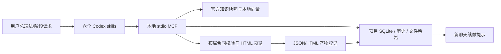

# 架构

## 边界

- `plugin/`：薄插件、六个技能、共享操作规则、数据库兼容脚本。缓存不包含模型或原生依赖。
- `runtime/`：MCP、官方采集与检索、workbench 项目/布局模块。知识模块与项目模块分别惰性使用；没准备资料仍能规划和生成预览。
- `data/` 或环境变量指向的目录：官方快照、按内容哈希去重的原图、模型；忽略提交。
- 用户项目 `.miliastra/`：独立于官方知识库的状态、失败经验、验收记录、布局；忽略发布。

项目存储以 revision 乐观并发控制和 SQLite 事务提交；Markdown 摘要可重建。MCP checkpoint 对项目内文件保存哈希。context 是只读审计，发现文件漂移会返回待验证的有效状态并沿依赖传播，不擅自改历史。证据类型限制避免用静态检查通过玩法验收，证据真实性仍由实际执行者和 Codex 对照产物确认。

布局用稳定设计 ID 表示结构与依赖，类型/属性仍从官方正文核对。纯校验不依赖知识模型；保存预览时同时登记 JSON、HTML。文件名带 UUID，事务冲突时保留待登记文件并返回路径。HTML 是自包含的方案检查器，不调用服务或游戏，也不是导入文件。

官方正文保存 HTML、完整 Markdown、索引正文、更新时间和哈希。索引按标题及 tokenizer 分段；节点归属依官方目录。图片保留原件，MCP 按需返回图片/裁剪/动画代表帧。查询模型仅本地 CPU 运行。每日目录检查可联网，但下载与活动版本替换仅通过用户明确执行 setup/sync。

更新使用独立暂存快照；资料、图片、索引和覆盖率全部通过后才原子替换活动指针。任何失败继续使用当前快照。历史官方快照虽可保留用于回退，日常工具只查询活动版本。
